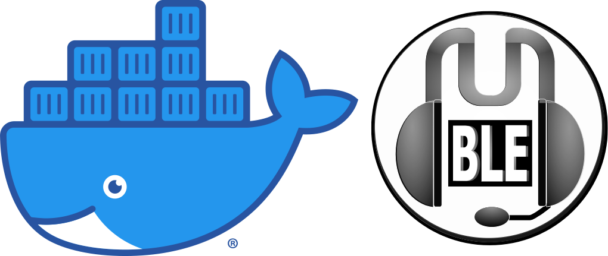

docker-mumble
=============

    

  
  
  
  
  

  Docker image for Mumble server.

Running the Container
---------------------

In order to persist configuration data when upgrading your container you should create a named data
volume. This is not required but is _highly_ recommended.

    docker volume create --name mumble-data

After the data volume has been created run the server container with the named data volume:

    docker run -d \
      -p 64738:64738 \
      -p 64738:64738/udp \
      -v mumble-data:/etc/mumble \
      --name mumble-server \
      phlak/mumble

#### Optional 'docker run' arguments

`-e SUPERUSER_PASSWORD=password` - Set the superuser password for your server during container initialization.

`-e TZ=America/Phoenix` - Set the timezone for your server. You can find your timezone in this
                          [list of timezones](https://goo.gl/uy1J6q). Use the (case sensitive)
                          value from the `TZ` column. If left unset, timezone will be UTC.

`--restart unless-stopped` - Always restart the container regardless of the exit status, but do not
                             start it on daemon startup if the container has been put to a stopped
                             state before. See the Docker [restart policies](https://goo.gl/Y0dlDH)
                             for additional details.

Get/Set the SuperUser Password
------------------------------

After starting your container, you can get the randomly generated SuperUser password with:

    docker logs mumble-server 2>&1 | grep "Password for 'SuperUser'"

**--- OR ---**

Provide a SuperUser password using the `SUPERUSER_PASSWORD` environment variable, see [Optional arguments section](#optional-docker-run-arguments).

**--- OR ---**

Manually set a new SuperUser password with:

    docker exec -it mumble-server supw

**NOTE:** This can be run at any time to update the SuperUser password

Edit the Config
---------------

Once you have a running container, you can edit the config with:

    docker exec -it mumble-server vi /etc/mumble/config.ini

After saving changes, restart your container:

    docker restart mumble-server

Troubleshooting
---------------

For general help and support join our [Slack Workspace](https://ln.phlak.net/join-slack).

Please report bugs to the [GitHub Issue Tracker](https://github.com/PHLAK/docker-mumble/issues).

Copyright
---------

This project is licensed under the [MIT License](https://github.com/PHLAK/docker-mumble/blob/master/LICENSE).
